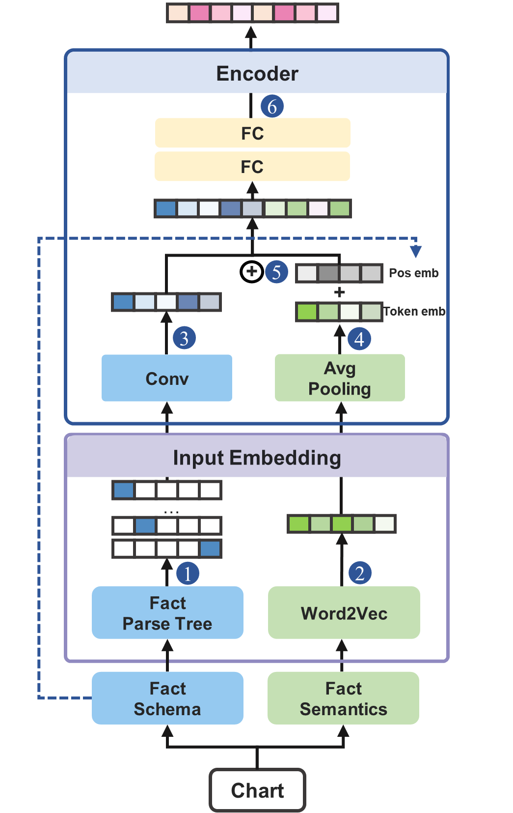
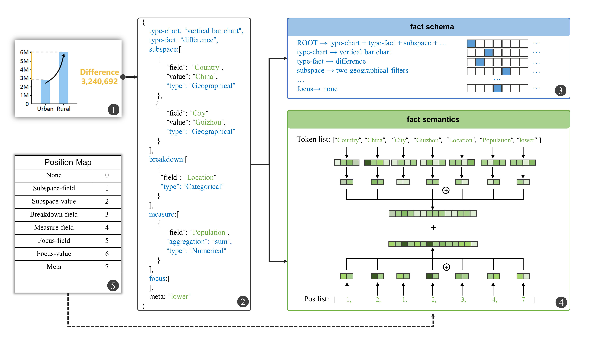

 English | [简体中文](./README.zh-CN.md)
# Chart2Vec:  A Universal Embedding of Context-Aware Visualizations

Chart2Vec is a chart embedding model in the visualization domain for transforming visual charts directly into vectors. The vectors generated by this model not only contain effective information about the individual charts themselves, but also cover the contextual relationships between the charts. "Context" refers to the adjacency of charts, which is usually present in multiple view visualizations (dashboards, data stories, etc.) Chart2Vec can be stored and computed as a new data format and applied to a variety of downstream tasks of the visualization: visual recommendation, clustering, interpolation, and so on.

<div align=center>
    
    <div>Chart2Vec model</div>
</div>

Chart2Vec consists of two core modules: Input embedding and Encoder. The repository contains the core code of Chart2Vec model, and the main functions of each folder/file are as follows:

* **_dataset/_**: training and testing data.
* **_input embedding/_**: represent the chart fact data as initial vectors.
* **_encoder/_**: further encoding of the initial vectors of the charts, integrating both structural and semantic information.
* **_utils/_**: data loading methods, constant definitions, and some helper code.
* **_train.py_**: code for training the model.
* **_test.py_**: inference code for the model.
* **_evaluate.py_**: model validation code.

## dataset

The _dataset/_ folder contains mainly the training dataset and testing dataset of the model, which are derived from the data storytelling platform [Calliope](https://datacalliope.com/) and [Tableau Public](https://public.tableau.com/)

* **_training_data.json_**: The training dataset for the model contains 42,222 training samples. Each training sample consists of 4 visualizations, the first three being visualizations that are connected in sequence to the same data story/dashboard, and the fourth being a negative example (not in the same data story/dashboard as the first three charts).
* **_testing_data.json_**: The testing dataset for the model contains 551 test samples. Each sample is declarative syntax data for a single chart visualization, where each chart is identified by fact_id and consists of three numbers, e.g., "281-816-1" means dataset #281 - data story/dashboard #816 - visualization #1.
* **_story_stopwords.txt_**: Stop words list.

**Note**: We use chart fact as the initial format for a single visualization, which consists of 7 tuples: chart fact={fact_type, chart_type, subspace, breakdown, measure, focus, meta}, some of these field definitions are derived from [Calliope](https://ieeexplore.ieee.org/document/9222368). The 7 tuples are explained in detail in the following table: 
|  Property   | Type  | Description |
|  ----  | ----  | ----  |
| fact_type  | String | Data fact type, with 10 options: `"trend"`, `"categorization"`, `"value"`, `"difference"`, `"distribution"`, `"proportion"`, `"rank"`, `"extreme"`, `"outlier"`, `"association"` |
| chart_type  | String | Chart type, with 18 options: `"Vertical Bar Chart"`, `"Pie Chart"`, `"Progress Bar Chart"`, `"Treemap"`, `"Line Chart"`, `"Text Chart"`, `"Area Chart"`, `"Horizontal Bar Chart"`, `"Proportion Isotype Chart"`, `"Scatter Plot"`, `"Color Filling Map"`, `"Bubble Chart"`, `"Ring Chart"`, `"Bubblemap"`, `"Isotype Bar Chart"`, `"Table"`, `"Network"`, `"Radar Chart"`  |
| subspace  | Object[] | Consists of a set of filters to filter the data range. |
| breakdown  | Object[] | consists of a set of array fields of temporal or categorical type, further dividing the data items of the subspace into groups. |
| measure  | Object[] | Numeric data fields that can be combined with different aggregation methods to further measure the data in the grouping |
| focus  | Object[] | Data item or data group requiring attention. |
| meta  | [] \| "" | Additional information about the chart, which varies according to fact type. |

## input_embedding and encoder

* **_input_embedding/semantic_extract.py_**: From the original chart data chart fact extract semantic information, i.e., extract the words with actual meaning, carry out word division, remove the deactivated words and then uniformly stored in an array.
* **_input_embedding/structual_extract.py_**: The structural information is extracted from the raw chart data chart fact and represented as a matrix of one-hot vectors.
* **_input_embedding/structual_rules.txt_**: The full set of rule information that can be extracted from chart fact.
* **_encoder/modeling_chart2vec.py_**: Chart2Vec core network structure for fusion of semantic and structural information of charts.

<div align=center>
    
    <div>Structural and semantic information in chart fact</div>
</div>

## Chart2Vec model

The trained Chart2Vec model is stored in the path: models/chart2vec_base.pth.

## Installation

Use pip to install the required Python packages from the file requirements.txt:

```shell
pip install -r requirements.txt
```

## Usage

**1. Direct utilization of the model: representation of charts as vectors**. The input is in the form of a heptad of charts and the output is a 300-dimensional vector.

```python
from utils.data_loader import *
from encoder.modeling_chart2vec import *

# Load Chart2Vec model
chart2vec_model = Chart2Vec().to(device)
path = os.path.dirname(__file__)
model_save_path = os.path.join(
    path, "models/chart2vec_base.pth")
state_dict = torch.load(model_save_path, map_location=torch.device(device))
chart2vec_model.load_state_dict(state_dict['model'])
chart2vec_model.eval()

# Prepare the chart 7 tuple as input
chart_fact = {"fact_type": "trend", "subspace": [], "breakdown": [{"field": "Year of release", "type": "temporal"}], "measure": [
    {"field": "Rating", "aggregate": "avg", "type": "numerical"}], "focus": [], "chart_type": "Area Chart", "meta": "increasing"}
# Alignment of data (multiple charts placed in a list is also supported)
input_chart = pad_w2v_convert_fact_to_input([chart_fact])

# Represent charts as vectors with Chart2Vec
output_vec = chart2vec_model(
    np.array([input_chart["batch_struct_one_hot"][0]]),
    np.array([input_chart["batch_indexed_tokens"][0]]),
    np.array([input_chart["batch_pos"][0]]))
# Output
print(output_vec[0].tolist())
```

**2. Training of the model: Retraining the model based on the new dataset**. Before formal training, the training dataset can be constructed as described in the paper and by referring to the file **_dataset/training_data.json_**. We give a sample code below:

```python
import torch
import json
from utils.data_loader import *
from encoder.modeling_chart2vec import *
from encoder.ImprovedQuadrupletLoss import *

def get_chart2vec_embeddings(chart2vec_model, chart_data):
    return chart2vec_model(chart_data["batch_struct_one_hot"], chart_data["batch_indexed_tokens"], chart_data["batch_pos"])

# The hyperparameter settings of the model can be adjusted according to the actual situation
epochs = 50
batch_size = 128
lr = 1e-2

# Setting up the machine on which the model will run
device = torch.device('cuda' if torch.cuda.is_available() else 'cpu')

# Load training data and build batch
with open("./dataset/training_data.json") as f:
        train_data = json.load(f)
batch_gen = quadruplet_batch_generator_word2vec(train_data, batch_size)

# multitasking loss function
loss_fc = ImprovedQuadrupletLoss().to(device)
chart_emb = Chart2Vec().to(device)
optimizer = torch.optim.Adam(
    filter(lambda p: p.requires_grad, chart_emb.parameters()), lr=lr)

# Iterative training model
best_loss = 1e7
for i in range(epochs):
    total_loss = 0.0
    for j in range(len(train_data)//batch_size):
        # Represent the charts in each training sample as vectors
        batch_chart_x1, batch_chart_x2, batch_chart_x3, batch_chart_y1 = next(batch_gen)
        res_chart_x1 = get_chart2vec_embeddings(chart_emb,batch_chart_x1)
        res_chart_x2 = get_chart2vec_embeddings(chart_emb,batch_chart_x2)
        res_chart_x3 = get_chart2vec_embeddings(chart_emb,batch_chart_x3)
        res_chart_y1= get_chart2vec_embeddings(chart_emb,batch_chart_y1)
        # calculate the loss function
        chart2vec_loss = loss_fc(res_chart_x1,  res_chart_x2, res_chart_x3, res_chart_y1)
        total_loss += chart2vec_loss.cpu().item()
        # Backpropagation for optimization
        chart2vec_loss.backward()
        optimizer.step()
        chart_emb.zero_grad()
        print("mean_loss:", chart2vec_loss.item())

    # Saving of models
    if total_loss < best_loss:
        best_loss = total_loss      
        torch.save({'model': chart_emb.state_dict()}, os.path.join("YOUR_MODEL_SAVE_PATH/chart2vec_base.pth"))
```

**3. Validation of the model: testing the ability of the Chart2Vec model to capture contextual relationships**.

* **Evaluation of indicators**: For model evaluation, we measure the ability of Chart2Vec embedding using three metrics: top-2 retrieval accuracy, top-3 retrieval accuracy, and co-occurrence, respectively, to evaluate whether it can effectively capture the contextual relationships among multiple charts.

  * **top-2 retrieval accuracy**. For anchored charts, the chart represented by the closest vector is searched for based on the distance between chart vectors, and if two charts originate from a unified data story and are spaced within 2 of each other, the anchored chart is compliant for this metric. Calculate all results for the test set of 560 charts and divide the number of charts that are compliant by the total number of charts for the final value.
  * **top-3 retrieval accuracy**.  Similar to the calculation of top-2 retrieval accuracy, an anchored chart is compliant on this metric if the retrieved chart and the anchored chart originate from a uniform data story and are spaced within 3 of each other.
  * **co-occurrence**. If the retrieved chart and the anchor chart originate from a unified data story, the anchor chart is compliant on co-occurrence. The final value of the metric can be obtained by counting the number of all eligible charts and dividing by the total number.

Below we give a sample code that validates the model's ability to capture context between charts:

```python
import os
import json
import torch
from tqdm import tqdm
import numpy
from utils.data_loader import *
from utils.constants import *
from encoder.modeling_chart2vec_word_max_pooling import *


def test_and_evaluate_chart2vec(trained_model_path, testing_data_file):
    """
        test and evaluate the chart2vec model
        Inputs:
            `model_save_path`: The directory where model iterations are saved during the training process, the overall directory is located under models.
            `training_data_file`: Filename of the training data.
    """
    # get the path to the current file
    path = os.path.dirname(__file__)
    # get the testing data
    with open(os.path.join(path, testing_data_file)) as f:
        test_data = json.load(f)

    # load the model and the parameters of the trained model
    chart2vec_model = Chart2Vec().to(device)
    model_save_path = os.path.join(
        path, "models", trained_model_path+"chart2vec_base.pth")
    state_dict = torch.load(model_save_path, map_location=torch.device(device))
    chart2vec_model.load_state_dict(state_dict['model'])
    chart2vec_model.eval()

    # construct test data into the input format required by the model
    input = pad_w2v_convert_fact_to_input(test_data)
    batch_struct_one_hot = input["batch_struct_one_hot"]
    batch_indexed_tokens = input["batch_indexed_tokens"]
    batch_pos = input["batch_pos"]
    input_len = len(batch_struct_one_hot)

    # represent each chart in the test data as a vector and store it in the result_dict
    result_dict = {}
    for i in tqdm(range(input_len), desc="data_num"):
        output_vec = chart2vec_model(
            np.array([batch_struct_one_hot[i]]), np.array([batch_indexed_tokens[i]]), np.array([batch_pos[i]]))
        result_dict[test_data[i]["fact_id"]] = output_vec[0].tolist()

    # evaluate the results
    acc2, acc3, acc_co = evaluate_more_nearest_dis_triplets(
        result_dict, search_num=1)
    print(acc2, acc3, acc_co)


def get_models_folder(dir_name):
    models_folder_list = os.listdir(dir_name)
    for folder in models_folder_list:
        if os.path.isfile(os.path.join(dir_name, folder)):
            models_folder_list.remove(folder)
    return models_folder_list


def evaluate_more_nearest_dis_triplets(data, search_num=1):
    """
        Validates Chart2Vec's modeling results against the vectors generated by the model. Specify a chart, calculate the top k nearest charts, determine if it is in the context window, and calculate the context distance.
    """
    same_dataset_facts, accuracy_list_window2, accuracy_list_window3, accuracy_list_story = {}, {}, {}, {}
    last_dataset_key = ""
    for key in list(data.keys()):
        dataset_label = key.split("-", 1)[0]
        if len(same_dataset_facts) == 0 or (len(same_dataset_facts) > 0 and dataset_label == list(same_dataset_facts.keys())[0].split("-", 1)[0]):
            same_dataset_facts[key] = data[key]
            last_dataset_key = key.split("-", 1)[0]
        else:
            # First calculate the accuracy between facts in the previous dataset
            accuracy_list_window2[last_dataset_key],  accuracy_list_window3[last_dataset_key], accuracy_list_story[last_dataset_key] = cal_same_dataset_facts_more_dis_min(
                same_dataset_facts, search_num)
            same_dataset_facts = {}
            same_dataset_facts[key] = data[key]
    accuracy_list_window2[key], accuracy_list_window3[key], accuracy_list_story[key] = cal_same_dataset_facts_more_dis_min(
        same_dataset_facts, search_num)
    return cal_avg_accuracy_value(accuracy_list_window2), cal_avg_accuracy_value(accuracy_list_window3), cal_avg_accuracy_value(accuracy_list_story)


def cal_avg_accuracy_value(accuracy_list):
    """
        Calculate the overall average
    """
    accuracy_list = dict(sorted(accuracy_list.items(),
                         key=lambda d: d[1], reverse=True))
    return numpy.mean(list(accuracy_list.values()))


def cal_same_dataset_facts_more_dis_min(facts_dict, search_num):
    """
        Calculate the closest chart based on the anchor chart
    """
    dis_map = {}
    facts_dict_key = list(facts_dict.keys())
    for i in range(len(facts_dict)):
        temp_dis_map = {}
        key1 = facts_dict_key[i]
        fact1_id = key1.split("-", 1)[1]
        value1 = numpy.array(facts_dict[key1])
        for j in range(len(facts_dict)):
            if i == j:
                continue
            key2 = facts_dict_key[j]
            fact2_id = key2.split("-", 1)[1]
            value2 = numpy.array(facts_dict[key2])
            dis = eucliDist(value1, value2)
            if len(temp_dis_map.keys()) < search_num:
                temp_dis_map[fact2_id] = dis
            else:
                # If the value is already stored, it looks for the maximum value and replaces it if it is smaller than it.
                temp_max_key = max(temp_dis_map, key=temp_dis_map.get)
                if dis < temp_dis_map[temp_max_key] and dis > 0:
                    del temp_dis_map[temp_max_key]
                    temp_dis_map[fact2_id] = dis
        dis_map[fact1_id] = temp_dis_map
    is_context, is_context_window2, is_context_window3, is_context_story = 0, 0, 0, 0
    for key in dis_map.keys():
        fact1_id = key
        for fact2 in dis_map[key].keys():
            fact2_id = fact2
            if fact1_id.split("-")[0] != fact2_id.split("-")[0]:
                continue
            if int(fact1_id.split("-")[1])+1 == int(fact2_id.split("-")[1]) or int(fact1_id.split("-")[1])-1 == int(fact2_id.split("-")[1]):
                is_context += 1
                is_context_window2 += 1
                is_context_window3 += 1
                is_context_story += 1
                break
            if int(fact1_id.split("-")[1])+2 == int(fact2_id.split("-")[1]) or int(fact1_id.split("-")[1])-2 == int(fact2_id.split("-")[1]):
                is_context_window2 += 1
                is_context_window3 += 1
                is_context_story += 1
                break
            if int(fact1_id.split("-")[1])+3 == int(fact2_id.split("-")[1]) or int(fact1_id.split("-")[1])-3 == int(fact2_id.split("-")[1]):
                is_context_window3 += 1
                is_context_story += 1
                break
            if int(fact1_id.split("-")[0]) == int(fact2_id.split("-")[0]):
                is_context_story += 1
                break
    window2_accuracy = float(is_context_window2/len(dis_map.keys()))
    window3_accuracy = float(is_context_window3/len(dis_map.keys()))
    story_accuracy = float(is_context_story/len(dis_map.keys()))
    return window2_accuracy, window3_accuracy, story_accuracy


def eucliDist(A, B):
    return numpy.sqrt(sum(numpy.power((A - B), 2)))


if __name__ == "__main__":
    test_and_evaluate_chart2vec(trained_model_path="models/chart2vec_base.pth", testing_data_file="dataset/testing_data_50.json")
```
